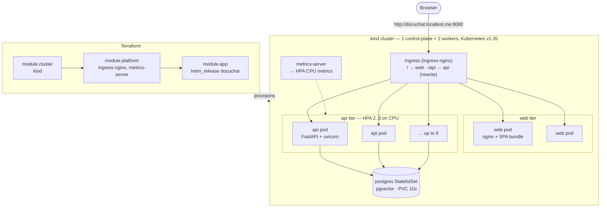

# ShipYard

A production-shaped Kubernetes deployment of an existing application, defined entirely as code.

The application is [DocuChat](https://github.com/yagaMI-Reverse/docuchat) — a FastAPI RAG backend and a React SPA that already ran fine on a single host with `docker compose`. ShipYard is everything you need around it to run it like a service: a Helm chart, a Terraform stack that builds the cluster and installs the release, health and autoscaling behaviour that actually works, and CI that proves it on every push.

Nothing here is a slideware claim. Every number below came out of a real run against a real cluster; the raw command output is in [`docs/proofs/`](docs/proofs/).

---

## What it does



Traffic enters through one Ingress hostname. `/` serves the SPA; `/api/*` is rewritten to `/*` and sent to the API Service. The SPA is built with a same-origin `/api` base, so there is no CORS configuration and no API hostname baked into the bundle — the same image works in any environment.

---

## Bring it up from nothing

Prerequisites: Docker Desktop, `kind`, `kubectl`, `terraform`, `helm`. On Windows:

```bash
winget install -e --id Kubernetes.kind --id Hashicorp.Terraform --id Helm.Helm
```

Then one command:

```bash
./scripts/up.ps1
```

That builds both images, creates the cluster, side-loads the images, installs the add-ons and the release, and prints the URL. Tear it down with `./scripts/down.ps1`.

| | |
|---|---|
| UI | http://docuchat.localtest.me:8080/ |
| API health | http://docuchat.localtest.me:8080/api/healthz |
| Metrics | http://docuchat.localtest.me:8080/api/metrics |

`*.localtest.me` resolves to `127.0.0.1` from any machine, so there is no hosts-file editing. The ingress is published on port 8080 rather than 80 because a workstation usually has something on 80 already.

### Why two applies

`scripts/up.ps1` runs `terraform apply -target=module.cluster` before the full apply. This is not a workaround for a bug — the `helm` and `kubernetes` providers are configured from the cluster's kubeconfig, and Terraform evaluates provider configuration *before* it applies anything. On a first run that file does not exist yet. Splitting the apply is the honest fix; the alternative in a real environment is that the cluster is provisioned by a separate stack entirely, with its own state, which is what I would do on a cloud provider.

---

## Proofs

Each of these is a script in `scripts/`, and each writes its raw output to `docs/proofs/`.

### 1. A version rollout serves every request

`scripts/proof-zero-downtime.ps1` builds a new image tag, side-loads it, and rolls it out **through `terraform apply`** — the same path a real deploy takes, not a hand-run `kubectl set image`. While that happens, it hits `/api/healthz` through the Ingress every 100 ms and counts every status code.

```
=== Zero-downtime rollout proof ===
probe url    : http://docuchat.localtest.me:8080/api/healthz
probe every  : 100ms
new image    : shipyard/docuchat-api:v2
duration     : 26.2s
requests     : 212
HTTP 200     : 212
failed       : 0
status codes : 200=212
```

The rollout itself was real, not a no-op restart:

```
$ kubectl get deploy shipyard-docuchat-api -o jsonpath='{...containers[0].image}'
shipyard/docuchat-api:v2

$ kubectl get rs -l app.kubernetes.io/component=api
shipyard-docuchat-api-6847db598c   2     2     2     69s   ← new
shipyard-docuchat-api-86bf764475   0     0     0     17m   ← drained
shipyard-docuchat-api-78984c6444   0     0     0     25m

# and the new pods say so themselves
{"level":"info","msg":"startup","version":"v2","documents":4,"loaded_from":"database"}
```

**212 requests during a live version rollout, 212 of them HTTP 200.** Full output: [`docs/proofs/zero-downtime.txt`](docs/proofs/zero-downtime.txt)

Three things make this work, and removing any one of them breaks it:

- **`maxUnavailable: 0`** in the Deployment's rolling update strategy. A new pod must pass its readiness probe before an old one is allowed to terminate.
- **A readiness probe that means something.** `/readyz` reports the index is built and the database is usable; a pod that answers TCP but cannot serve is not Ready and gets no traffic.
- **`preStop: sleep 5`.** Endpoint removal propagates to kube-proxy and the ingress controller asynchronously with pod termination. Without the pause, a pod can stop accepting connections while the ingress is still sending it some — a small but reliable source of 502s during deploys.

### 2. The HPA scales on real load

`scripts/proof-hpa.ps1` runs a k6 profile (`scripts/load.js`) against `POST /api/chat` and samples the HorizontalPodAutoscaler once a second.

```
time      replicas  cpu-target
17:49:19         2           2      ← idle
17:49:48         2          19      ← load ramping
17:50:02         4          93      ← first scale-out
17:50:19         6         162
17:50:33         6         195      ← peak CPU vs the 60% target
17:50:48         8         130      ← at maxReplicas, utilisation falling
17:53:18         8          57      ← load ramping down
```

then, after the load stopped:

```
17:54:18         6           1
17:54:34         4           1
17:54:50         3           1
17:55:06         2           1      ← back to minReplicas
```

k6's own summary for the run:

```
checks_succeeded : 100.00%  41972 out of 41972
http_req_failed  : 0.00%    0 out of 41972
http_req_duration: avg=498ms  p(95)=690ms  max=810ms
iterations       : 41972      174.5/s
vus_max          : 150
```

**2 → 8 replicas and back to 2, with zero failed requests out of 41,972.** Full output: [`docs/proofs/hpa-scale.txt`](docs/proofs/hpa-scale.txt)

The load is honest: `/chat` runs a TF-IDF transform and cosine similarity over the document set on every request. There is no synthetic burn endpoint added to make the graph move. What the endpoint *also* does is stream its answer with a deliberate 20 ms pause between tokens, so a single request is ~500 ms of wall time and very little CPU — which is why the profile drives 150 concurrent users rather than a high request rate. Tuning the *load* to the application is the honest move here; tuning the *CPU request* down until the existing load crossed the threshold would have produced a prettier graph and proven nothing.

### 3. A deleted pod heals itself

`scripts/proof-self-heal.ps1` deletes a running API pod and polls the Deployment until a replacement is Ready, probing through the Ingress the whole time.

```
deleted pod    : shipyard-docuchat-api-86bf764475-5kb9t
recovery time  : 31.7s to Deployment Available + all pods Ready
probes during  : 250
failed probes  : 0
```

Full output: [`docs/proofs/self-healing.txt`](docs/proofs/self-healing.txt)

**Where this stops being true, honestly:** deleting *every* API pod at once does cause an outage — I tried it, and the Ingress returned 503 until the first replacement became Ready. A PodDisruptionBudget does not prevent that, because a PDB governs *voluntary* disruptions (node drains, cluster upgrades, the eviction API), not a direct `kubectl delete`. Surviving the loss of a whole tier at once is a multi-zone problem, not a PDB one.

### 4. Documents survive the pods

The API persists uploaded documents to Postgres write-through and reloads them at startup:

```
# upload through the Ingress, then delete every API pod
$ kubectl delete pods -l app.kubernetes.io/component=api

# the replacement pods log where their knowledge base came from
{"level":"info","msg":"startup","documents":4,"chunks":4,
 "persistence":true,"loaded_from":"database","pod":"shipyard-docuchat-api-86bf764475-5kb9t"}

$ curl .../api/chat -d '{"message":"what is the magic word"}'
data: {"delta": "The "} data: {"delta": "magic "} data: {"delta": "word "} data: {"delta": "is "}
data: {"delta": "pineapple. "}
```

The document uploaded before the restart still answers afterwards, from a pod that never saw the upload.

---

## Design decisions worth defending

**Liveness and readiness check different things, on purpose.** `/healthz` never touches Postgres. If it did, a database blip would fail liveness on every replica at once and the kubelet would restart the entire fleet — turning a recoverable dependency outage into a self-inflicted one. `/readyz` *does* check the database: an unready pod leaves the Service endpoints but keeps running and rejoins by itself.

**`/readyz` asserts the schema exists, not just that a connection opens.** This one came from a real failure during this build. The API pods started before the Postgres StatefulSet's DNS record existed, so schema creation failed with `Temporary failure in name resolution`, every write was silently dropped — and readiness reported healthy the whole time, because `SELECT 1` worked fine. The check now runs `SELECT to_regclass('public.documents')`, and the application retries with backoff at startup instead of giving up after one attempt. There is also a `wait-for-db` initContainer, so a pod that cannot reach the database never joins the Ready pool in the first place. Three layers, because the failure was invisible with one.

**The trade-off that comes with that:** tying readiness to the database means a database outage takes the API out of rotation even though it could still answer from its in-memory index. I chose that deliberately — serving reads while silently discarding uploads is a worse failure than being honestly unavailable. In a read-heavy production service the opposite call is defensible, and the change is one line in `k8s_runtime.py`.

**Resource requests are the real autoscaling knob.** HPA utilisation is measured against the CPU *request*, not the limit. `requests.cpu: 200m` with a 60% target means a pod scales out at roughly 120m of sustained CPU. Requests also drive scheduling, so setting them by "what makes the HPA look good" quietly breaks bin-packing.

**Everything runs unprivileged.** Both workloads: `runAsNonRoot`, dropped capabilities, `readOnlyRootFilesystem` with explicit `emptyDir` mounts for the paths that genuinely need writes (`/tmp`, nginx's cache). The frontend uses `nginx-unprivileged` on port 8080 rather than patching the stock image. Postgres is the documented exception — it writes runtime state outside its data directory, and mounting around that buys nothing on a single-node demo.

**Chart version bumps are load-bearing.** Terraform's `helm_release` diffs the chart *version*, not the contents of a local chart directory. Editing a template without bumping `Chart.yaml` makes `terraform apply` report "No changes" while the cluster keeps running the old manifests. I hit this mid-build; it is now a comment in `Chart.yaml`.

---

## CI/CD

Three workflows, all in `.github/workflows/`:

| Workflow | Trigger | What it does |
|---|---|---|
| `validate.yml` | every push / PR | `helm lint` both value sets, render and check every manifest with `kubeconform -strict`, `terraform fmt -check` + `validate`, `hadolint` on both Dockerfiles |
| `release.yml` | main, `v*` tags | builds both images and pushes to GHCR with semver/SHA tags and a GHA layer cache |
| `e2e-kind.yml` | every push / PR | creates a real kind cluster in the runner, installs the add-ons and the chart, then **re-runs the smoke test, the zero-downtime rollout check and the self-healing check** |

`kubeconform -strict` is the part worth calling out: it rejects unknown fields, so a typo like `resource:` instead of `resources:` fails the build. Without `-strict` that manifest applies cleanly and silently does nothing.

The e2e workflow deploys with Helm directly rather than Terraform — Terraform's job is validated separately, and asking a CI runner to build a cluster *and* run a two-stage apply buys minutes of wall clock for no extra signal.

---

## Repository layout

```
app/                     vendored DocuChat source (unchanged demo logic)
  backend/               FastAPI service
    k8s_runtime.py       ← the only real addition: probes, JSON logs, metrics, persistence
  frontend/              React SPA + its nginx config
charts/docuchat/         the Helm chart (16 objects)
terraform/
  main.tf                root stack: cluster → platform → app
  modules/cluster/       kind cluster with ingress port mappings
  modules/platform/      ingress-nginx + metrics-server
  modules/app/           the DocuChat helm_release
scripts/                 up/down + the three proof scripts + the k6 profile
docs/proofs/             raw output of the runs quoted above
```

The application code is vendored rather than submoduled so the repository builds on its own and CI can produce images without a second checkout. The DocuChat demo logic is untouched; everything Kubernetes needs from the app lives in `k8s_runtime.py` so the two are easy to tell apart.

---

## State: moving this to a remote backend

State is local (`terraform/terraform.tfstate`), which is correct for a disposable cluster on one workstation and wrong for anything shared. It is also why `.gitignore` excludes it: the rendered Helm values include the demo database password, and the kubeconfig carries client certificates.

For a team, replace the `backend "local"` block in `terraform/versions.tf` with:

```hcl
terraform {
  backend "s3" {
    bucket       = "acme-tfstate"
    key          = "shipyard/terraform.tfstate"
    region       = "eu-central-1"
    encrypt      = true
    use_lockfile = true   # S3-native locking; DynamoDB is no longer required
  }
}
```

Then `terraform init -migrate-state`. The bucket needs versioning enabled — state corruption is recoverable, state loss is not.

---

## What I would do differently in a cloud cluster

The chart would move over mostly unchanged; the platform underneath it would not.

- **Managed control plane** (EKS/GKE/AKS) instead of kind, and node groups instead of `kind_cluster`. `module.platform` and `module.app` stay as they are — that split is the point of the module boundary.
- **Secrets do not come from the chart.** The demo renders `DATABASE_URL` into a Secret from values, which is fine for a local demo and unacceptable in production, where it lands in Terraform state in plaintext. Real answer: External Secrets Operator or Sealed Secrets, with the value in Secrets Manager / Vault, and IRSA (or Workload Identity) so pods authenticate as themselves instead of holding a static credential.
- **Postgres would not run in the cluster.** A single-replica StatefulSet has no failover, no PITR, and no automated backups. It is here to make the persistence and PVC behaviour real; in production it is RDS/Cloud SQL, and the only chart change is `postgres.enabled: false` plus `api.externalDatabaseUrl` — which is why that switch exists.
- **cert-manager + ExternalDNS**, so the Ingress hostname and its TLS certificate are also declarative rather than a port mapping and an HTTP listener.
- **Multi-AZ with real anti-affinity.** The chart already sets `topologySpreadConstraints` on `kubernetes.io/hostname` with `ScheduleAnyway` so a single-node cluster stays schedulable; in a cloud cluster that becomes `topology.kubernetes.io/zone` with `DoNotSchedule`.
- **GitOps for the delivery half.** Terraform is the right tool for the cluster and its add-ons; it is a mediocre one for continuously reconciling application releases. Argo CD or Flux watching the chart, with Terraform stopping at `module.platform`.
- **Observability past `/metrics`.** The endpoint is there and Prometheus scrape annotations are set, but nothing collects it here. Real cluster: kube-prometheus-stack, alerts on the SLIs the probes already expose, and the JSON logs shipped to Loki — they are structured for exactly that.

---

## Honest scope

This is a local cluster on one machine. It demonstrates the manifests, the module structure, the failure modes and the verification method — not the operational experience of running a multi-tenant production cluster. What the proofs above show is that the deployment behaves correctly under rollout, load and pod loss, and that the claims are reproducible by anyone who runs `./scripts/up.ps1`.
